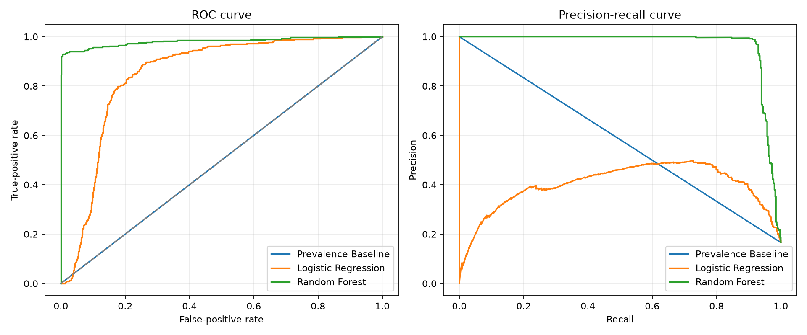
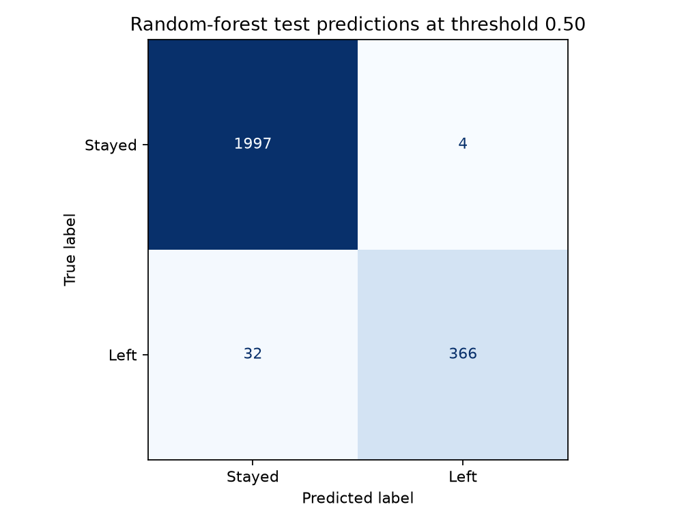
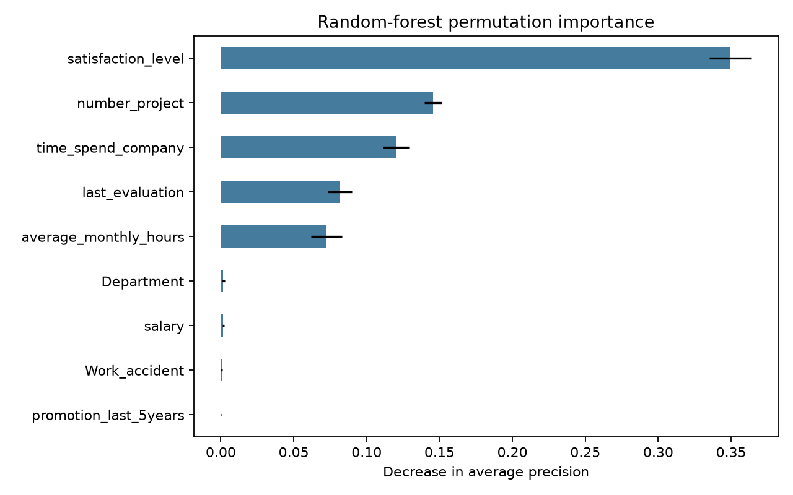

# Employee Attrition Prediction

A reproducible machine-learning project built from the Salifort Motors scenario in the [Google Advanced Data Analytics Capstone](https://www.coursera.org/learn/google-advanced-data-analytics-capstone). It compares a transparent logistic-regression baseline with a nonlinear random forest and evaluates both on an untouched, stratified test set.

## Data provenance

`Datasets/HR_capstone_dataset.csv` is the original course-provided dataset that was already included in this repository. **No external, generated, or synthetic employee records were added.** The file contains 14,999 rows and ten supplied fields covering satisfaction, evaluation, projects, monthly hours, tenure, workplace accidents, promotions, department, salary band, and whether the employee left.

The dataset has no employee identifier. It contains 3,008 exact repeated rows after the first occurrence, but those rows cannot be proven to represent the same people. The primary model uses the 11,991 distinct rows so identical records cannot leak across the training and test partitions. This is documented as a modeling safeguard rather than a claim about employee identity.

## Verified results

The final 80/20 split uses 9,592 training rows and 2,399 test rows. The test set is used once for final evaluation; five-fold cross-validation is performed only on the training partition.

| Model | ROC-AUC | Average precision | Precision | Recall | F1 | Accuracy |
| --- | ---: | ---: | ---: | ---: | ---: | ---: |
| Logistic regression | 0.848 | 0.395 | 0.430 | 0.847 | 0.570 | 0.788 |
| Random forest | 0.981 | 0.966 | 0.989 | 0.920 | 0.953 | 0.985 |

ROC-AUC and average precision are calculated from predicted probabilities—not hard class labels. The random forest correctly identifies 366 of the 398 employees who left in the held-out test set, with four false-positive predictions at the default 0.50 threshold.





## What the model uses

Held-out permutation importance shows that the random forest relies most strongly on satisfaction, project count, tenure, last evaluation, and average monthly hours.



These are predictive associations, not causal findings. The model does not prove that workload, evaluations, or any other field causes attrition. Satisfaction and evaluation may also be unavailable—or already affected by management decisions—at the intended prediction time.

## Run the project

Python 3.11 or newer is recommended.

```bash
python -m venv .venv
# Windows: .venv\Scripts\activate
# macOS/Linux: source .venv/bin/activate
pip install -r requirements.txt
python train.py
```

This command validates the supplied CSV, trains all three comparison models, runs cross-validation, evaluates the held-out test set, regenerates the report and charts, and writes the fitted random-forest pipeline to `artifacts/model.joblib`. The generated model is intentionally ignored by Git because serialized models are version-sensitive and should never be loaded from untrusted sources.

After training, score a record with the complete raw feature schema:

```bash
python predict.py --record "{\"satisfaction_level\":0.62,\"last_evaluation\":0.74,\"number_project\":4,\"average_monthly_hours\":190,\"time_spend_company\":3,\"Work_accident\":0,\"promotion_last_5years\":0,\"Department\":\"sales\",\"salary\":\"medium\"}"
```

Run the quality checks with:

```bash
pip install -r requirements-dev.txt
ruff check .
python -m pytest -q
```

## Repository structure

```text
attrition_model/
  data.py              Schema validation and repeated-row policy
  training.py          Preprocessing, training, evaluation, and charts
Datasets/
  HR_capstone_dataset.csv
notebooks/
  original_google_capstone.ipynb
artifacts/
  metrics.json         Exact test and cross-validation results
  model_report.md      Generated findings and responsible-use notes
  feature_reliance.csv Held-out permutation importance
  figures/             Generated evaluation charts
train.py               Rebuild the complete analysis
predict.py             Score one record with the trained pipeline
tests/                  Dataset and model-interface tests
```

The original course notebook is retained for provenance. The reusable package is the supported workflow and fixes its broken local paths, Colab-only model exports, preprocessing leakage risk, and class-label-based AUC calculation.

## Responsible use and limitations

- Salifort Motors is a course scenario; these results should not be presented as production performance at a real employer.
- The file provides no collection date, employee identifier, protected attributes, or future cohort, so temporal stability and subgroup fairness cannot be established.
- A random split tests performance on this supplied dataset, not transfer to another company or time period.
- Predictions should support aggregate investigation and voluntary retention efforts, never automated compensation, promotion, discipline, or termination decisions.
- Production use would require a defined prediction time, lawful employee-data governance, fairness review, drift monitoring, explainability, and accountable human review.

See [artifacts/model_report.md](artifacts/model_report.md) and [artifacts/metrics.json](artifacts/metrics.json) for the generated evidence.

## License

Original project code is available under the [MIT License](LICENSE). The course-provided dataset and archived notebook retain their original terms and are not relicensed.
